# Data integration using Azure Data Factory and Azure Data Share

As customers embark on their modern data warehouse and analytics projects, they require not only more data but also more visibility into their data across their data estate. This workshop dives into how improvements to Azure Data Factory and Azure Data Share simplify data integration and management in Azure. From enabling code-free ETL/ELT to creating a comprehensive view over your data, improvements in Azure Data Factory will empower your data engineers to confidently bring in more data, and thus more value, to your enterprise. Also, learn about Azure Data Share and how you can do B2B sharing in a governed manner.

In this workshop, you will use Azure Data Share to receive data from a third party Azure SQL database (SQL DB) into your Azure Data Lake Storage Gen2 (ADLS Gen2). You will use Azure Data Factory (ADF) to ingest data from your own SQL DB into ADLS Gen2. Once both datasets are in the data lake, you will join and transform them using a mapping data flow, data factory's native transformation service, and sink it into Azure Synapse Analytics (formerly SQL DW).

The data used in this lab is New York City taxi data. To import it into your Azure SQL database, download the [taxi-data bacpac file](https://github.com/djpmsft/ADF_Labs/blob/master/sample-data/taxi-data.bacpac).

## Contents
- [Prerequisites](#prerequisites)
- [Share and receive data using Azure Data Share](#share-and-receive-data-using-azure-data-share)
  * [Share data (data provider flow)](#share-data-data-provider-flow)
  * [Receive data (data consumer flow)](#receive-data-data-consumer-flow)
- [Ingest and transform data using Azure Data Factory](ingest-and-transform-data-using-azure-data-factory)
  * [Set up your Azure Data Factory environment](#set-up-your-azure-data-factory-environment)
  * [Ingest data from using the copy activity](#ingest-data-from-azure-sql-db-into-adls-gen2-using-the-copy-activity)
  * [Transform data using mapping data flow](#transform-data-using-mapping-data-flow)

## Prerequisites

* **Azure subscription**: If you don't have an Azure subscription, create a [free account](https://azure.microsoft.com/free/) before you begin.

* **Azure SQL Database**: If you don't have a SQL DB, learn how to [create a SQL DB account](https://docs.microsoft.com/azure/sql-database/sql-database-single-database-get-started?tabs=azure-portal)

* **Azure Data Lake Storage Gen2 storage account**: If you don't have an ADLS Gen2 storage account, learn how to [create an ADLS Gen2 storage account](https://docs.microsoft.com/azure/storage/blobs/data-lake-storage-quickstart-create-account).

* **Azure Synapse Analytics (formerly SQL DW)**: If you don't have an Azure Synapse Analytics (formerly SQL DW), learn how to [create an Azure Synapse Analytics instance](https://docs.microsoft.com/azure/sql-data-warehouse/create-data-warehouse-portal).

* **Azure Data Factory**: If you have not created a data factory, see how to [create a data factory](https://docs.microsoft.com/azure/data-factory/quickstart-create-data-factory-portal).

* **Azure Data Share**: If you have not created a data share, see how to [create a data share](https://docs.microsoft.com/azure/data-share/share-your-data#create-a-data-share-account).

## Share and receive data using Azure Data Share

In this section, you will learn how to share and receive data in Azure portal. 

First, you will pretend to be the *third party data provider* to share data. This will involve creating a new share which will contain datasets from Azure SQL Database. You will then configure a snapshot schedule, which will give the data consumers an option to automatically refresh the data being shared with them. Then, you will invite recipients to your share. 

Next, you will switch hats and become the *data consumer*. As the data consumer, you will walk through the flow of accepting a share invitation, configuring where you'd like the data to be received and mapping datasets to ADLS Gen2 storage account. Then, you will trigger a snapshot which will copy the data shared with you into the destination specified. 

### Share data (Data Provider flow)

1. Open the Azure portal in either Microsoft Edge or Google Chrome.

1. Using the search bar at the top of the page, search for **Data Shares**

    

1. Select the data share account with 'Provider' in the name. For example, **DataProvider-123456**. 

1. Select **Start sharing your data**

    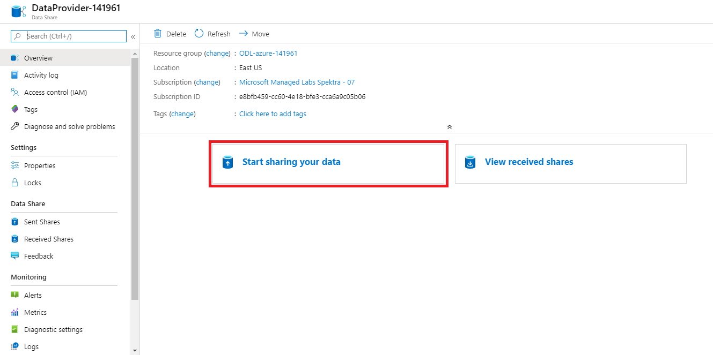

1. Select **+Create** to start configuring your new share. 

    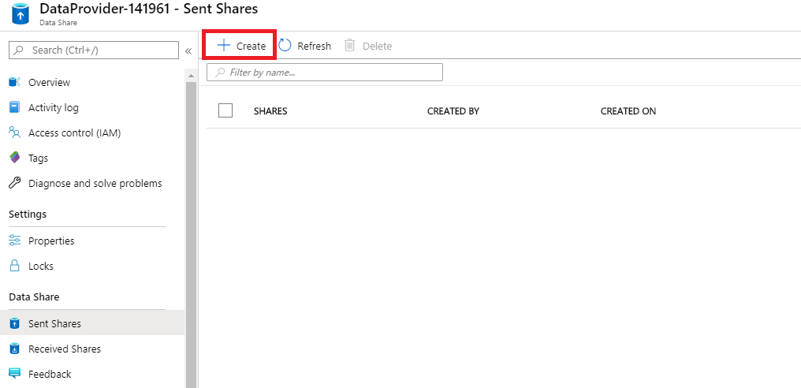

1. Fill in the share details. Under **Share name**, specify a name of your choice. Note that this is the share name that will be seen by your data consumer, so be sure to give it a descriptive name such as TaxiData. Under **Description**, put in a sentence which describes the contents of the share. The share will contain New York Taxi trip fare data. Under **Terms of use**, specify a set of terms that you would like your data consumer to adhere to. Some examples include "Do not distribute this data outside your organization" or "Refer to legal agreement". Select **Continue**. 

   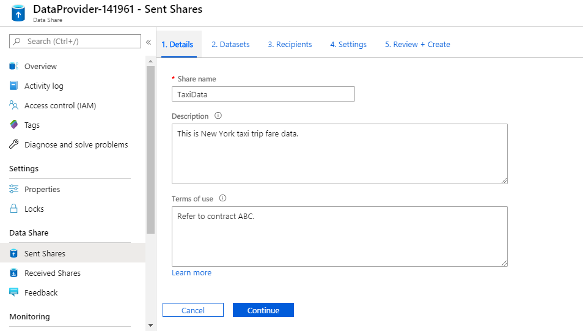

1. Select **Add datasets** 

   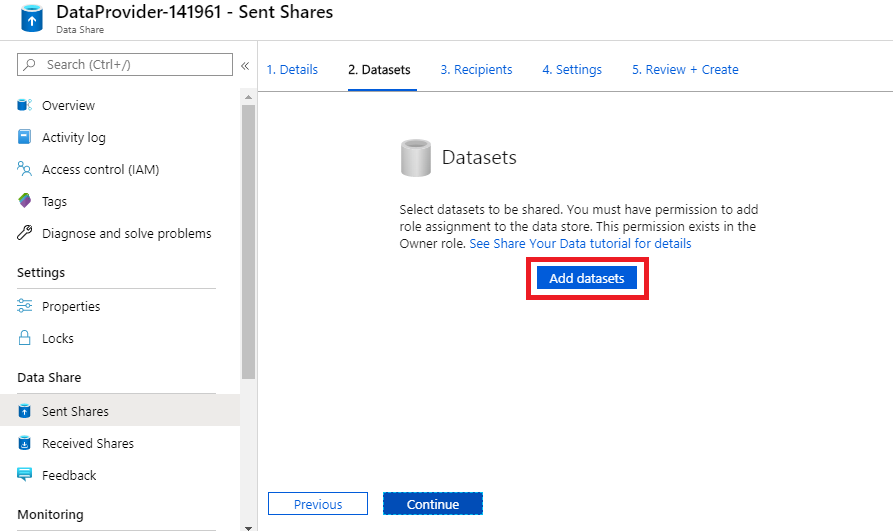

1. Select **Azure SQL Database**.

   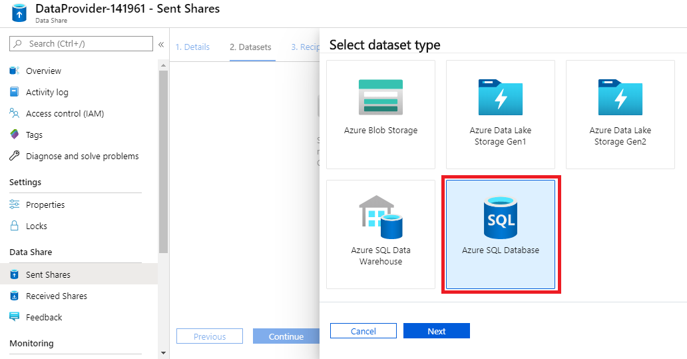
    
1. Select the SQL server with "sqldb3rdparty-srv" in the name (for example, **sqldb3rdparty-srv-123456**). Authenticate with your SQL server admin login and password. You will be given a script to run before you can proceed. The script provided creates a user in the SQL database to allow the Data Share resource's managed identity to authenticate on its behalf. **Copy** the script.

   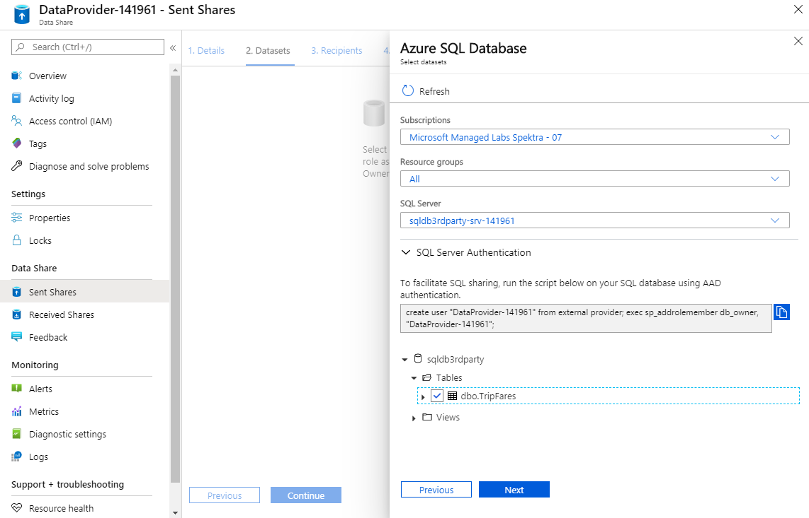

1. Open a new web browser tab and navigate to the Azure portal. Make sure you are logged into the same tenant using the same login credentials provided for the lab. Select the SQL Database **sqldb3rdparty**. Select **Query editor (preview)** and **Active Directory authentication**. 

   Note that prior to this step, you must set yourself as the Active Directory Admin for the SQL server, and allow your client IP to access the SQL server. These two steps have been completed for you in the lab environment. 

   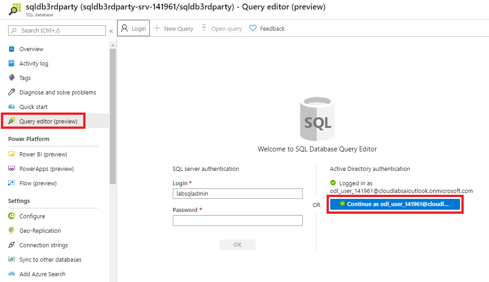

1. Paste the script copied from Azure Data Share and run the query. The script looks like below where "DataProvider-xxxxxx" is the name of your data share resource (for example, **DataProvider-123456**).

   ```
   create user "DataProvider-xxxxxx" from external provider; exec sp_addrolemember db_owner, "DataProvider-xxxxxx";
   ```
   
   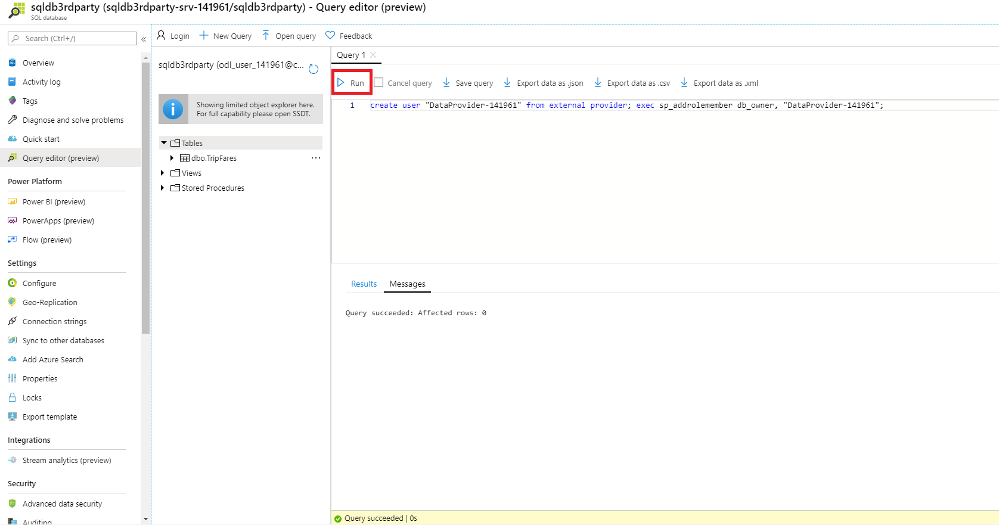
      
1. Switch back to Azure Data Share where you were adding datasets to your share. 

1. Select SQL Database **sqldb3rdparty**, and select table **TripFares**. 

1. Click **Next** to confirm the dataset name, then click **Add dataset**.

1. Review the dataset has been added and select **Continue**. 

   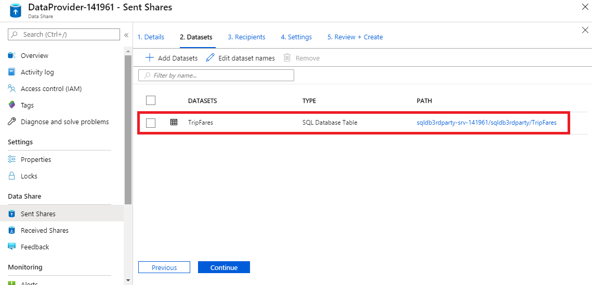

1. Add recipients to your share. The recipients you add will receive invitations to your share. Click **Add recipient** and enter email address. Use login e-mail address of your Azure tenant for the lab. Select **Continue**.

   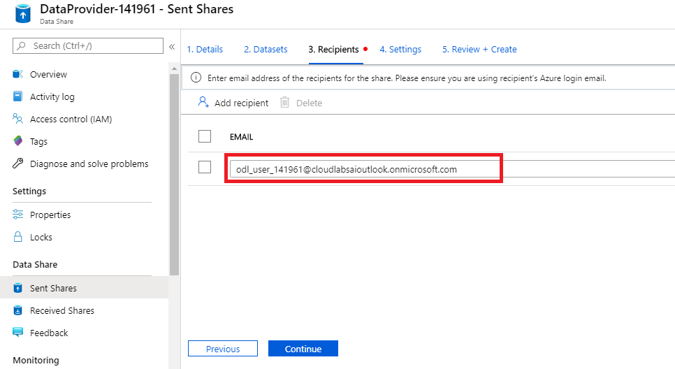

1. Configure a snapshot schedule for your data consumer. This will allow them to receive regular updates (hourly or daily) of your data at an interval defined by you. Check **Snapshot Schedule**. Leave the Start time and Recurrence as default. Select **Continue**.

   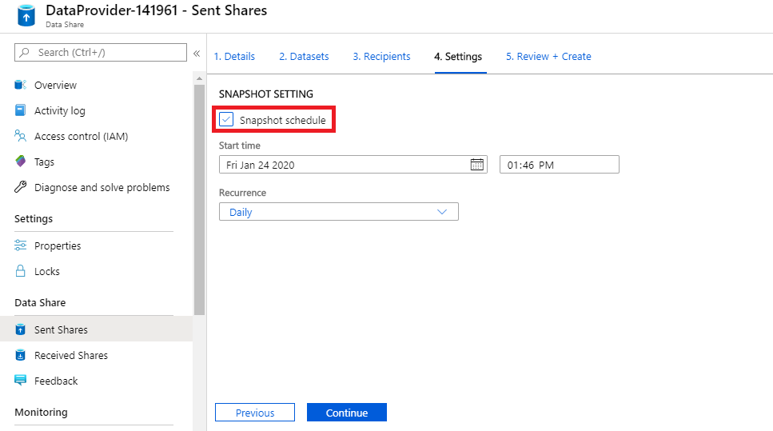

1. Review everything and select **Create**. A share is now created in your Sent Shares.

   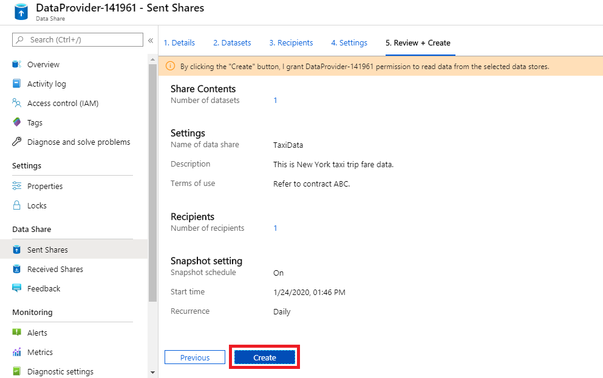

   Let's review what you can see as a data provider after you have created share. 

   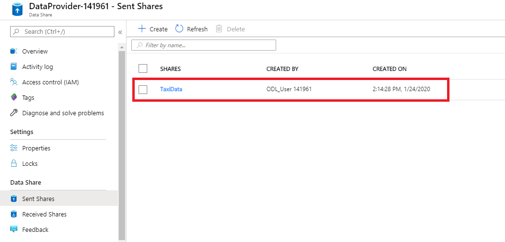

1. Select the share that you just created (for example, **TaxiData**).

1. In **Details** tab, you can view share name, description, terms of use and snapshot schedule. Note that you can disable the snapshot schedule if you choose. 

1. Select the **Datasets** tab. Note that you can add or remove datasets after it has been created. 

1. Select the **Share subscriptions** tab. Note that no share subscriptions exist yet because your data consumer has not yet accepted your invitation.

1. Select the **Invitations** tab. Here you'll see a list of pending invitations, send invitiation to additional users or delete invitations prior to user accepting it.

1. Select the **History** tab. Note that nothing is displayed as yet because your data consumer has not yet accepted your invitation and triggered a snapshot. 

### Receive data (Data consumer flow)

Now you are switching hat to be the data consumer. As a data consumer, you will receive data into your ADLS Gen2 account and then in the next section of the lab, you will use Azure Data Factory to process the data. 

1. You should now have an Azure Data Share invitation in your inbox from Microsoft Azure. In web browser, type **outlook.com** to launch Outlook Web Access. Log in using the credentials supplied for your Azure tenant.

   Note if you are unable to access email during your lab, you can login to Azure portal using the lab credentials, and type 'Data Share Invitation' in the search to find a list of invitations.

1. In the e-mail that you should have received (it may take up to a few minutes for the email to arrive), click on **View invitation >**. Log into Azure portal with your lab credentials.

   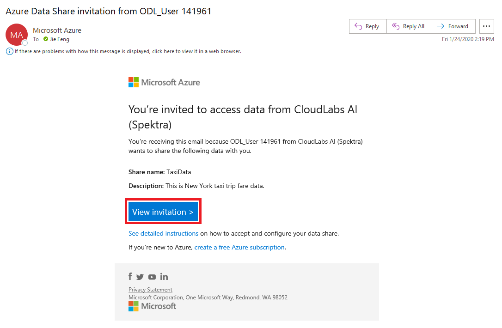 

1. In the list 'Data Share Invitations', select the invitation titled **TaxiData**. 

   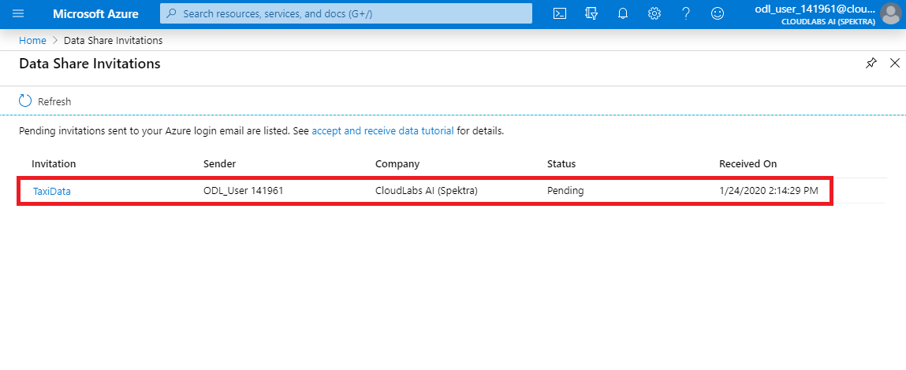

1. Review invitation details and accept the **terms of use** if provided.

   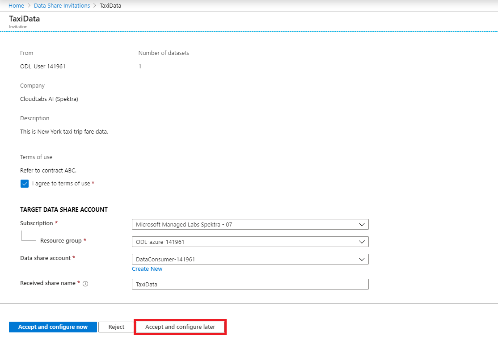

1. Under 'TARGET DATA SHARE ACCOUNT', select the Subscription and Resouce Group (for example, **ODL-azure-123456-01**). Make sure to select resource group with **-01** at the end. For **Data share account**, select a data share resource with 'dataConsumer' in the name (for example, **DataConsumer-123456**). Note that you can also have the option to create a new Azure Data Share resource. 

1. For **Received share name**, you'll notice the default share name is the name that was specified by the data provider (for example, **TaxiData**). You can leave the name as is.

1. Select **Accept and configure later**. 

   You are now taken to the 'DataConsumer' data share resource. In the list of 'Received Shares', you should see 'TaxiData'.

1. Select the received share (for example, **TaxiData**).

   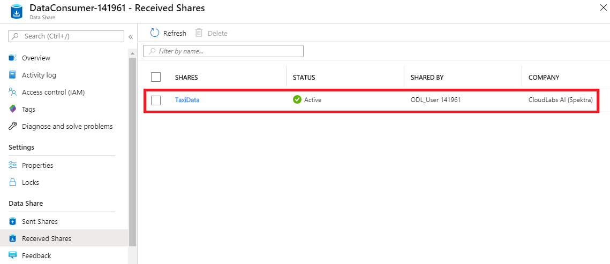

1. Select the **Datasets** tab to specify a target Azure data store to receive the data. Check **TripFares** and then select **+ Map to Target**.

   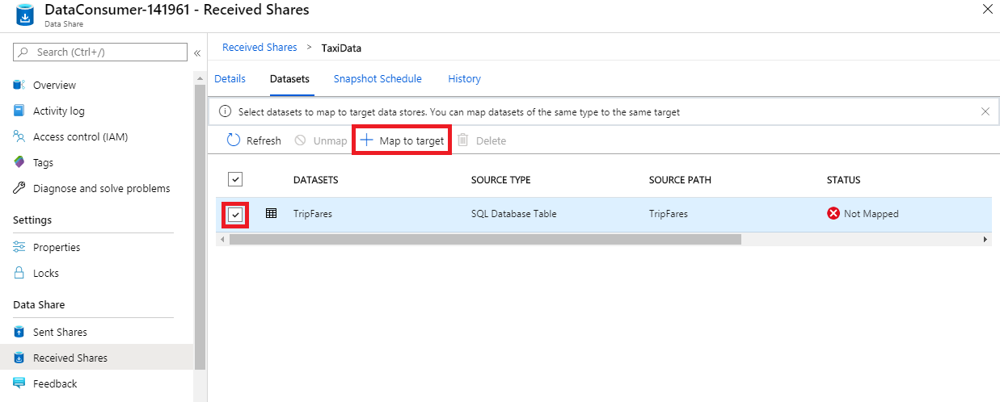

1. On the right hand side of the screen, from the **Target Data Type** drop down, you will notice a list of options for where you can receive the data into. Select **Azure Data Lake Store Gen2**, enter Azure subscription and resource group (for example, **ODL-azure-123456-01**). Make sure to select resource group with **-01** at the end for this lab. Specify **adlsg2storoizec3owmu3b6** as the storage account, and **taxidata** as the file system name. You have an option to choose either CSV or Parquet output file format. Leave it as default **Csv**. Click **Map to target**.

   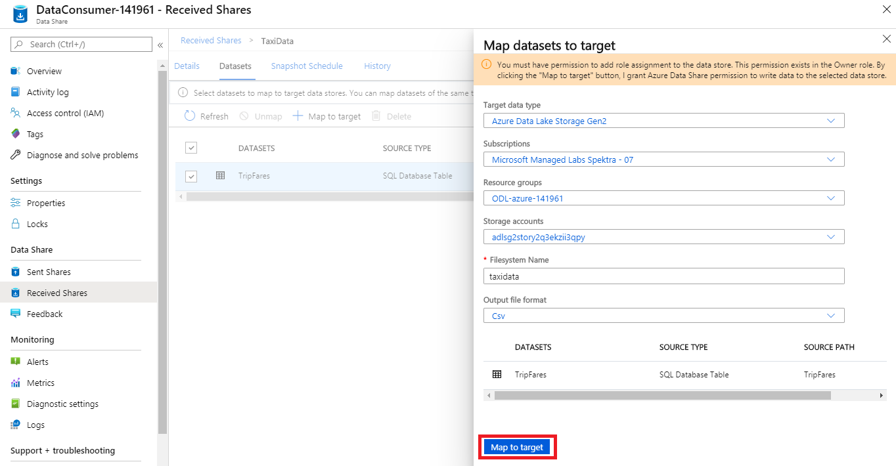

   Now dataset is mapped, and you are ready to receive data. 
    
1. Select **Snapshot Schedule**. Here you can view and enable the automated update schedule provided by data provider. Check the checkbox right next to the schedule and select **+Enable**.

   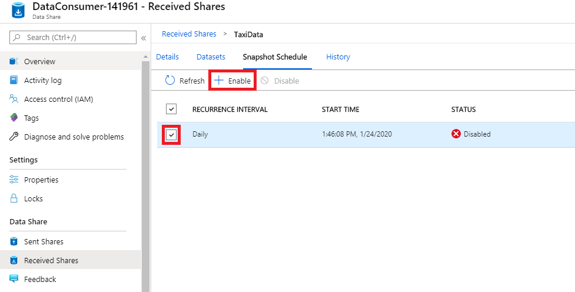

1. Select **Details** tab, and select **Trigger snapshot -> Full Copy**. This will start copying data into the target storage account you specified in the previous step. It will take approximately 3-5 minutes for the data to come across. 

   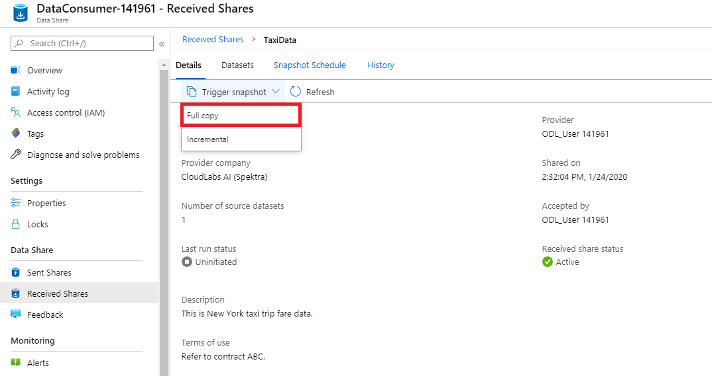

1. Select **History** tab, and click **Refresh** to monitor snapshot status.

1. While you are waiting, navigate to the data provider's data share resource (for example, **DataProvider-123456**). Select **Sent Share** in left navigation, then **TaxiData**, and view the status of the **Share Subscriptions** and **History** tab. Click **Refresh** if no data is showing. Notice that there is now an active share subscription, and as a data provider, you can also monitor when snapshots of the data are sent to data consumer. 

1. Navigate back to the data consumer's data share resource (for example, **DataConsumer-123456**). Select **Received Share** in left navigation, then **TaxiData**. Click on **History** tab to verify the status of the snapshot is successful. Click on "Start' time to drill into the snapshot history. Click on **Succeeded** to view details of the snapshot result.

   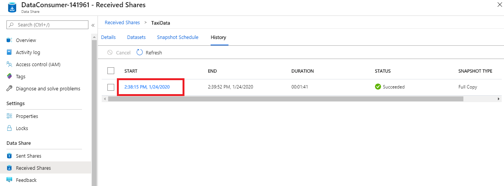

1. Select **Datasets** tab, click on the link under 'PATH' which should look similar to this: adlsg2storoizec3owmu3b6/taxidata/TripFares.csv. It will navigate to your ADLS Gen2 account **adlsg2storoizec3owmu3b6** where the data is received into.

   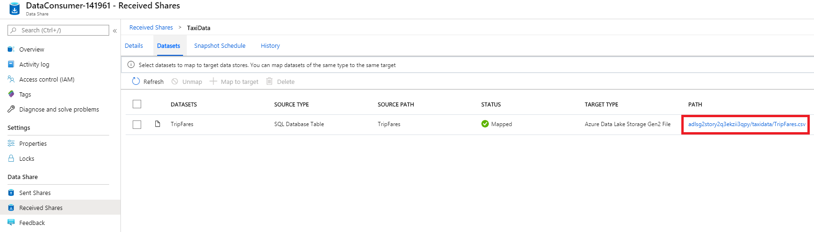

1. In the storage account, open **Storage Explorer (preview)** to verify the filesystem 'taxidata' is created, and within it, there should be a file named 'TripFares.csv'.

   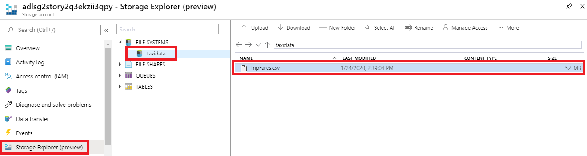

This concludes the Azure Data Share portion of the lab. In the next section, you will use Azure Data Factory to process the received data.

## Ingest and transform data using Azure Data Factory

Now that you have consumed data using Azure Data Share, it is time to ingest the corresponding dataset and then transform the data using Azure Data Factory.

## Set up your Azure Data Factory environment

In this section, you will learn how to access the Azure Data Factory user experience (ADF UX) from the Azure portal. Once in the ADF UX, you will configure three linked service for each of the data stores we are using: Azure SQL DB, ADLS Gen2, and Azure Synapse Analytics.

In Azure Data Factory, linked services define the connection information to external resources. Azure Data Factory currently supports over 85 connectors.

### Open the Azure Data Factory UX

1. Open the [Azure portal](https://portal.azure.com) in either Microsoft Edge or Google Chrome.
1. Using the search bar at the top of the page, search for 'Data Factories'

    
1. Click on your data factory resource to open up its resource blade.

    
1. Click on **Author and Monitor** to open up the ADF UX. The ADF UX can also be accessed at adf.azure.com.

    
1. You will be redirected to the homepage of the ADF UX. This page contains quick-starts, instructional videos and links to tutorials to learn data factory concepts. To start authoring, click on the pencil icon in left side-bar.

    

### Create an Azure SQL database linked service

1. The authoring page is where you create data factory resources such as pipelines, datasets, data flows, triggers and linked services. To create a linked service, click on the **Connections** button in the bottom-right corner.

    
1. In the connections tab, click **New** to add a new linked service.

    
1. The first linked service you will configure is an Azure SQL DB. You can use the search bar to filter the data store list. Click on the **Azure SQL Database** tile and click continue.

    
1. In the SQL DB configuration pane, enter 'SQLDB' as your linked service name. Enter in your credentials to allow data factory to connect to your database. If you're using SQL authentication, enter in the server name, the database, your user name and password. You can verify your connection information is correct by clicking **Test connection**. Click **Create** when finished.

    

### Create an Azure Synapse Analytics linked service

1. Repeat the same process to add an Azure Synapse Analytics linked service. In the connections tab, click **New**. Select the **Azure Synapse Analytics (formerly SQL DW)** tile and click continue.

    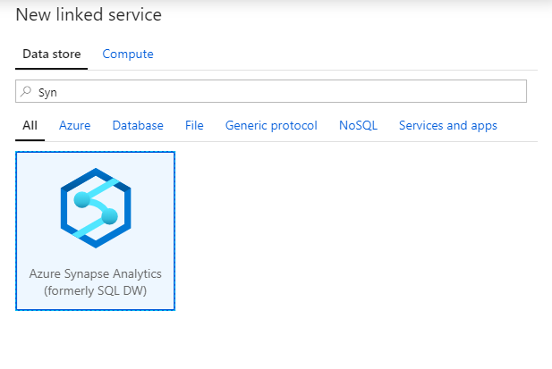
1. In the linked service configuration pane, enter 'SQLDW' as your linked service name. Enter in your credentials to allow data factory to connect to your database. If you're using SQL authentication, enter in the server name, the database, your user name and password. You can verify your connection information is correct by clicking **Test connection**. Click **Create** when finished.

    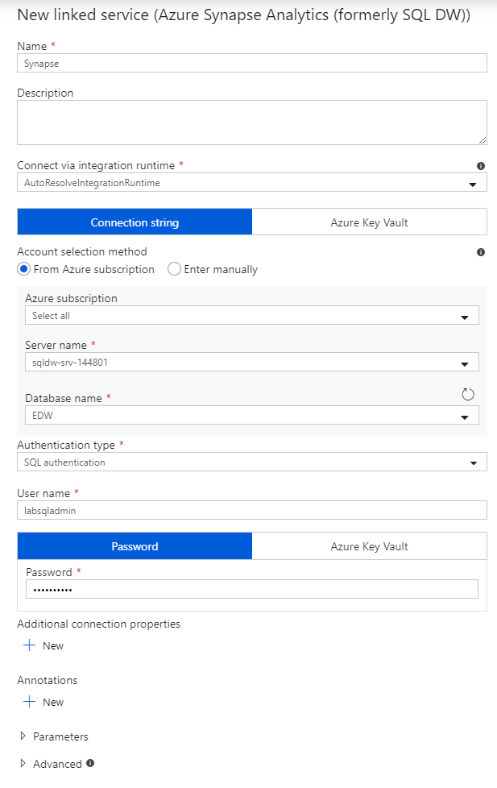

### Create an Azure Data Lake Storage Gen2 linked service

1. The last linked service needed for this lab is an Azure Data Lake Storage gen2.  In the connections tab, click **New**. Select the **Azure Data Lake Storage Gen2** tile and click continue.

    
1. In the linked service configuration pane, enter 'ADLSGen2' as your linked service name. If you're using Account key authentication, select your adls gen2 storage account from the **Storage account name** dropdown. You can verify your connection information is correct by clicking **Test connection**. Click **Create** when finished.

    

### Turn on data flow debug mode

In section *Transform data using mapping data flow*, you will be building mapping data flows. A best practice before building mapping data flows is to turn on debug mode which allows you to test transformation logic in seconds on an active spark cluster.

To turn on debug, click the **Data flow debug** slider in the factory top bar. Click ok when the confirmation dialog pop-ups. The cluster will take about 5-7 minutes to start-up. Continue on to *Ingest data from Azure SQL DB into ADLS gen2 using the copy activity* while it is initializing.


## Ingest data from Azure SQL DB into ADLS gen2 using the copy activity

In this section, you will create a pipeline with a copy activity that ingests one table from a Azure SQL DB into an ADLS gen2 storage account. You will learn how to add a pipeline, configure a dataset and debug a pipeline via the ADF UX. The configuration pattern used in this section can be applies to copying from a relational data store to a file-based data store.

In Azure Data Factory, a pipeline is a logical grouping of activities that together perform a task. An activity defines an operation to perform on your data. A dataset points to the data you wish to use in a linked service.

### Create a pipeline with a copy activity

1. In the factory resources pane, click on the plus icon to open the new resource menu. Select **Pipeline**.

    
1. In the **General** tab of the pipeline canvas, name your pipeline something descriptive such as 'IngestAndTransformTaxiData'.

    
1. In the activities pane of the pipeline canvas, open the **Move and Transform** accordion and drag the **Copy data** activity onto the canvas. Give the copy activity a descriptive name such as 'IngestIntoADLS'.

    

### Configure Azure SQL DB source dataset

1. Click on the **Source** tab of the copy activity. To create a new dataset, click **New**. Your source will be the table 'dbo.TripData' located in the linked service 'SQLDB' configured earlier.

    
1. Search for **Azure SQL Database** and click continue.

    
1. Call your dataset 'TripData'. Select 'SQLDB' as your linked service. Select table name 'dbo.TripData' from the table name dropdown. Import the schema **From connection/store**. Click OK when finished.

    

You have successfully created your source dataset. Make sure in the source settings, the default value **Table** is selected in the use query field.

### Configure ADLS Gen 2 sink dataset

1. Click on the **Sink** tab of the copy activity. To create a new dataset, click **New**.

    
1. Search for **Azure Data Lake Storage Gen2** and click continue.

    
1. In the select format pane, select **DelimitedText** as you are writing to a csv file. Click continue.

    
1. Name your sink dataset 'TripDataCSV'. Select 'ADLSGen2' as your linked service. Enter where you want to write your csv file. For example, you can write your data to file `trip-data.csv` in container `staging-container`. Set **First row as header** to true as you want your output data to have headers. Since no file exists in the destination yet, set **Import schema** to **None**. Click OK when finished.

    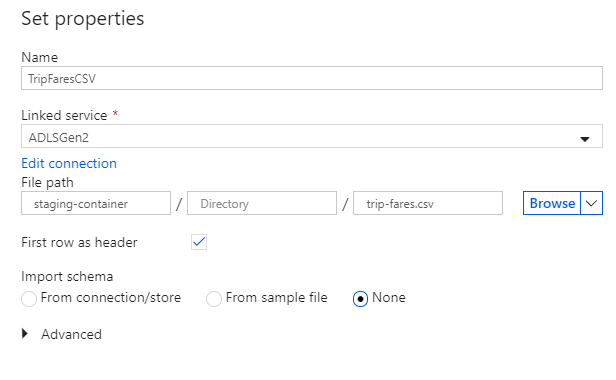

### Test the copy activity with a pipeline debug run

1. To verify your copy activity is working correctly, click **Debug** at the top of the pipeline canvas to execute a debug run. A debug run allows you to test your pipeline either end-to-end or until a breakpoint before publishing it to the data factory service.

    
1. To monitor your debug run, go to the **Output** tab of the pipeline canvas. The monitoring screen will auto-refresh every 20 seconds or when you manually click the refresh button. The copy activity has a special monitoring view which can be access by clicking the eye-glasses icon in the **Actions** column.

    
1. The copy monitoring view gives the activity's execution details and performance characteristics. You can see information such as data read/written, rows read/written, files read/written, and throughput. If you have configured everything correctly, you should see 49,999 rows written into one file in your ADLS sink.

    
1. Before moving on to the next section, its suggested that you publish your changes to the data factory service by clicking **Publish all** in the factory top bar. While not covered in this lab, Azure Data Factory supports full git integration. Git integration allows for version control, iterative saving in a repository, and collaboration on a data factory. For more information, see [source control in Azure Data Factory](https://docs.microsoft.com/azure/data-factory/source-control#troubleshooting-git-integration).

    

## Transform data using mapping data flow

Now that you have successfully copied data into Azure Data Lake Storage, it is time to join and aggregate that data into a data warehouse. We will use mapping data flow, Azure Data Factory's visually designed transformation service. Mapping data flows allow users to develop transformation logic code-free and execute them on spark clusters managed by the ADF service.

The data flow created in this step inner joins the 'TripDataCSV' dataset created in the previous section with the 'TripFares.csv' file shared via Azure Data Share. based on four key columns. Then the data gets aggregated based upon column `payment_type` to calculate the average of certain fields and written in a Azure Synapse Analytics table.

### Add a data flow activity to your pipeline

1. In the activities pane of the pipeline canvas, open the **Move and Transform** accordion and drag the **Data flow** activity onto the canvas.

    
1. In the side pane that opens, select **Create new data flow** and choose **Mapping data flow**. Click **OK**.

    
1. You'll be directed to the data flow canvas where you will be building your transformation logic. In the general tab, name your data flow 'JoinAndAggregateData'.

    

### Configure your trip data csv source

1. The first thing you want to do is configure your two source transformations. The first source will point to the 'TripDataCSV' DelimitedText dataset. To add a source transformation, click on the **Add Source** box in the canvas.

    
1. Name your source 'TripDataCSV' and select the 'TripDataCSV' dataset from the source drop-down. If you remember, you didn't import a schema initially when creating this dataset as there was no data there. Since `trip-data.csv` exists now, click **Open** to go to the dataset settings tab.

    
1. Go to tab **Schema** and click **Import schema**. Select **From connection/store** to import directly from the file store. Fourteen columns of type string should appear.

    
1. Go back to data flow 'JoinAndAggregateData'. If your debug cluster has started (indicated by a green circle next to the debug slider), you can get a snapshot of the data in the **Data Preview** tab. Click **Refresh** to fetch a data preview.

    

    *Note: Data preview does not write data.*

### Configure your trip fares csv source

1. The second source you're adding will point at the csv file 'TripFares.csv' that was shared during the Azure Data Share portion of the lab. Under your 'TripDataCSV' source, there will be another **Add Source** box. Click it to add a new source transformation.

    
1. Name this source 'TripFaresCSV'. Click **New** next to the source dataset field to create a new ADLS gen2 dataset.

    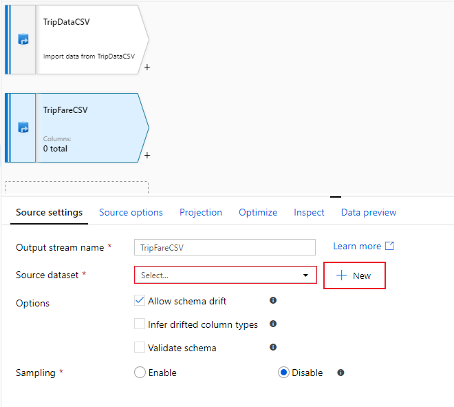
1. Select the **Azure Data Lake Storage gen2** tile and click continue.

    *Note: You may notice many of the connectors in data factory are not supported in mapping data flow. To transform data from one of these sources, ingest it into a supported source using the copy activity*.

    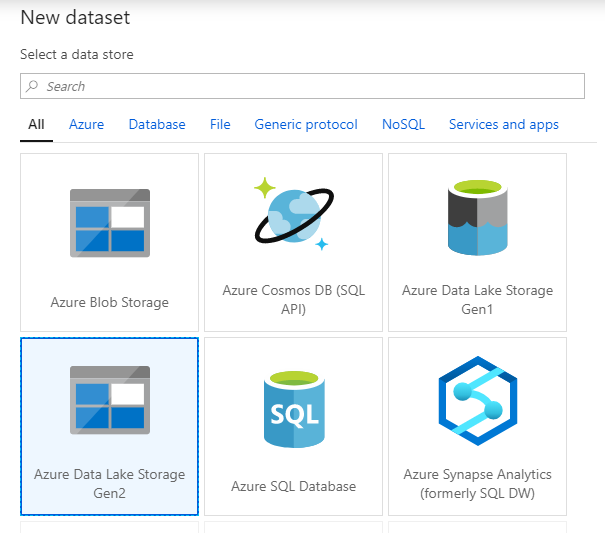

1. In the select format pane, select **DelimitedText** as you are reading from a csv file. Click continue.

    
1. Name your dataset 'TripFaresCSV'. Select 'ADLSGen2' as your linked service. Point this at the file shared in the Data Share lab. It should be called `TripFares.csv` in container `taxidata`. Set **First row as header** to true as the input data has headers. Import the schema **From connection/store**. Click OK when finished.

    *If you didn't complete the Data Share portion of the lab, the file will be located in the container 'sample-data'*

    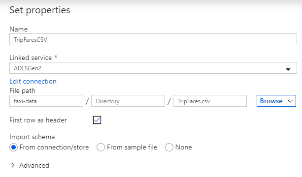
1. To verify your source is configured correctly, fetch a data preview in the **Data Preview** tab.

    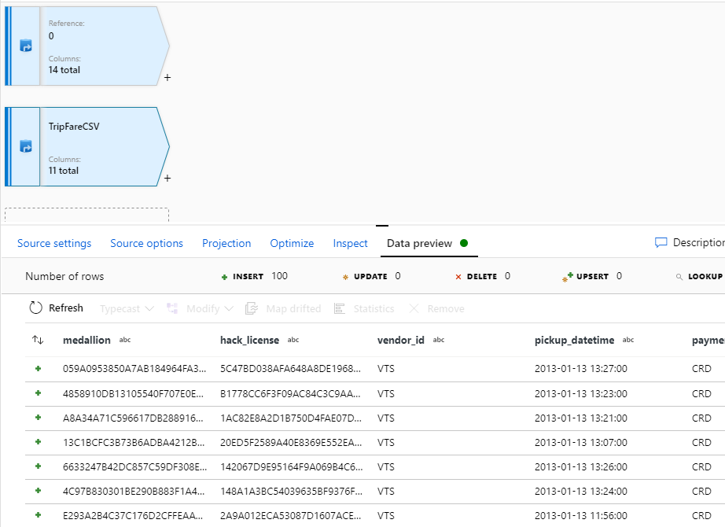

### Inner join TripDataCSV and TripFaresSQL

1. To add a new transformation, click the plus icon in the bottom-right corner of 'TripDataCSV'. Under **Multiple inputs/outputs**, select **Join**.

    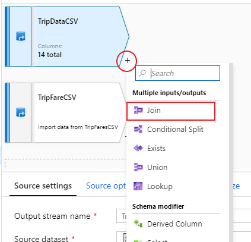
1. Name your join transformation 'InnerJoinWithTripFares'. Select 'TripFaresCSV' from the right stream dropdown. Select **Inner** as the join type. To learn more about the different join types in mapping data flow, see [join types](https://docs.microsoft.com/azure/data-factory/data-flow-join#join-types).

    Select which columns you wish to match on from each stream via the **Join conditions** dropdown. To add an additional join condition, click on the plus icon next to an existing condition. By default, all join conditions are combined with an AND operator which means all conditions must be met for a match. In this lab, we want to match on columns `medallion`, `hack_license`, `vendor_id`, and `pickup_datetime`

    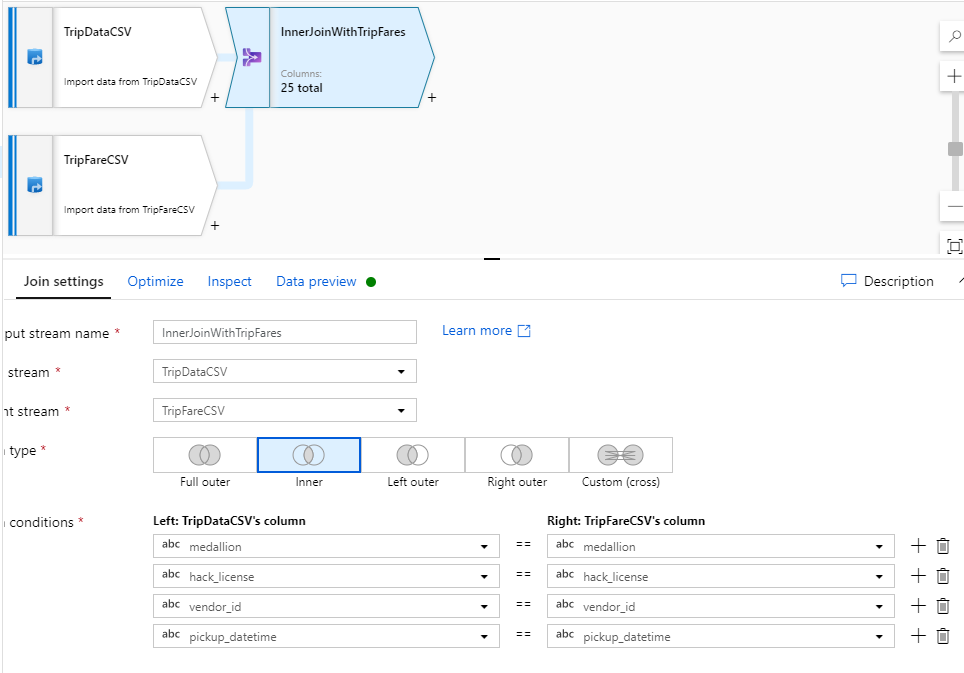
1. Verify you successfully joined 25 columns together with a data preview.

    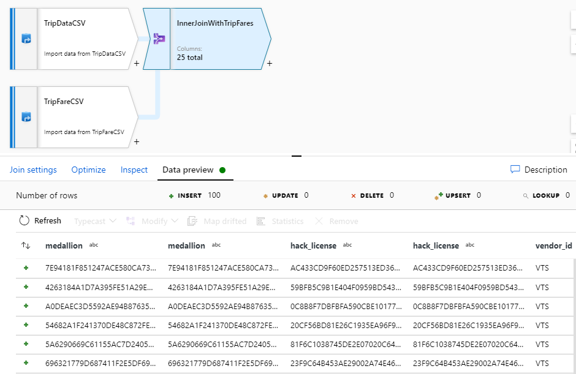

### Aggregate by payment_type

1. After you complete your join transformation, add an aggregate transformation by clicking the plus icon next to 'InnerJoinWithTripFares. Choose **Aggregate** under **Schema modifier**.

    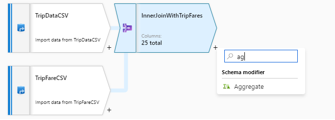
1. Name your aggregate transformation 'AggregateByPaymentType'. Select `payment_type` as the group by column.

    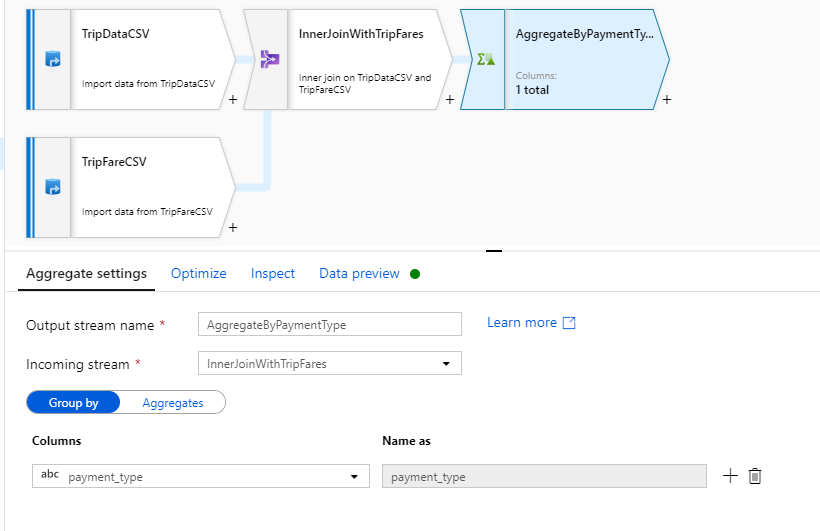
1. Go to the **Aggregates** tab. Here, you will specify two aggregations:
    * The average fare grouped by payment type
    * The total trip distance grouped by payment type

    First, you will create the average fare expression. In the text box labeled **Add or select a column**, enter 'average_fare'.

    
1. To enter an aggregation expression, click the blue box labeled **Enter expression**. This will open up the data flow expression builder, a tool used to visually create data flow expressions using input schema, built-in functions and operations, and user-defined parameters. For more information on the capabilities of the expression builder, see the [expression builder documentation](https://docs.microsoft.com/azure/data-factory/concepts-data-flow-expression-builder).

    To get the average fare, use the `avg()` aggregation function to aggregate the `total_amount` column cast to an integer with `toInteger()`. In the data flow expression language, this is defined as `avg(toInteger(total_amount))`. Click **Save and finish** when you are done.

    
1. To add an additional aggregation expression, click on the plus icon next to `average_fare`. Select **Add column**.

    
1. In the text box labeled **Add or select a column**, enter 'total_trip_distance'. As in the last step, open the expression builder to enter in the expression.

    To get the total trip distance, use the `sum()` aggregation function to aggregate the `trip_distance` column cast to an integer with `toInteger()`. In the data flow expression language, this is defined as `sum(toInteger(trip_distance))`. Click **Save and finish** when you are done.

    
1. Test your transformation logic in the **Data Preview** tab. As you can see, there are significantly less rows and columns than previously. Only the three group by and aggregation columns defined in this transformation continue downstream. As there are only five payment type groups in the sample, only five rows are outputted.

    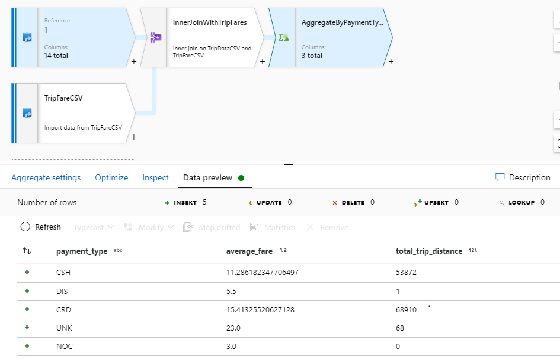

### Configure you Azure Synapse Analytics sink

1. Now that we have finished our transformation logic, we are ready to sink our data in an Azure Synapse Analytics table. Add a sink transformation under the **Destination** section.

    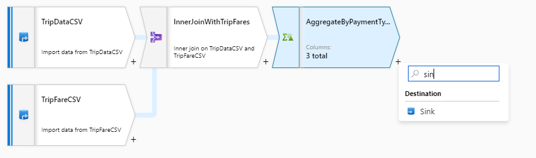
1. Name your sink 'SQLDWSink'. Click **New** next to the sink dataset field to create a new Azure Synapse Analytics dataset.

    

1. Select the **Azure Synapse Analytics (formerly SQL DW)** tile and click continue.

    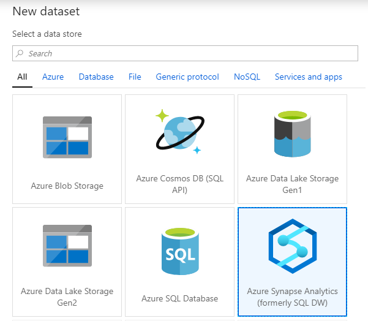
1. Call your dataset 'AggregatedTaxiData'. Select 'SQLDW' as your linked service. Select **Create new table** and name the new table dbo.AggregateTaxiData. Click OK when finished

    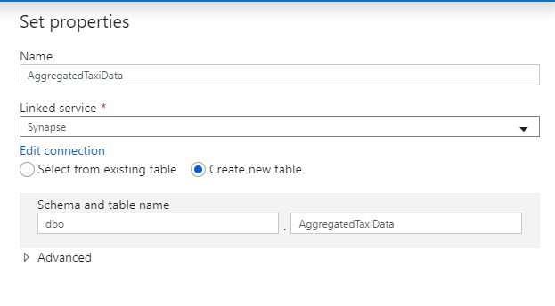
1. Go to the **Settings** tab of the sink. Since we are creating a new table, we need to select **Recreate table** under table action. Unselect **Enable staging** which toggles whether we are inserting row-by-row or in batch.

    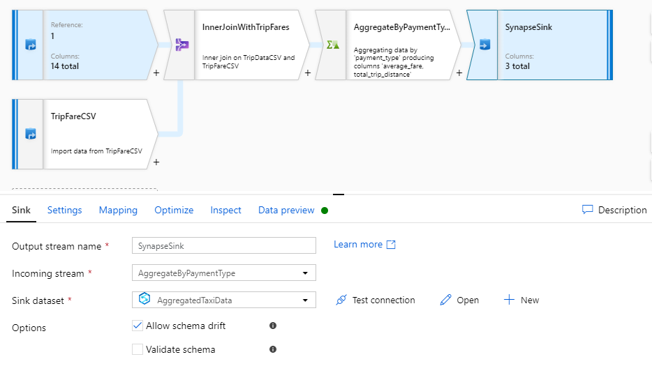

You have successfully created your data flow. Now its time to run it in a pipeline activity.

### Debug your pipeline end-to-end

1. Go back to the tab for the **IngestAndTransformData** pipeline. Notice the green box on the 'IngestIntoADLS' copy activity. Drag it over to the 'JoinAndAggregateData' data flow activity. This creates an 'on success' which causes the data flow activity to only run if the copy is successful.

    
1. As we did for the copy activity, click **Debug** to execute a debug run. For debug runs, the data flow activity will use the active debug cluster instead of spinning up a new cluster. This pipeline will take a little over a minute to execute.

    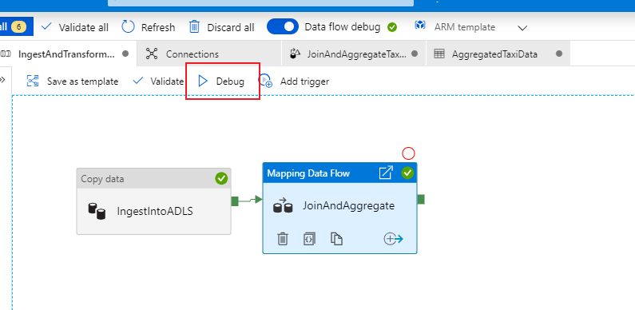
1. Like the copy activity, the data flow has a special monitoring view accessed by the eyeglasses icon on completion of the activity.

    
1. In the monitoring view, you can see a simplified data flow graph along with the execution times and rows at each execution stage. If done correctly, you should have aggregated 49,999 rows into 5 rows in this activity.

    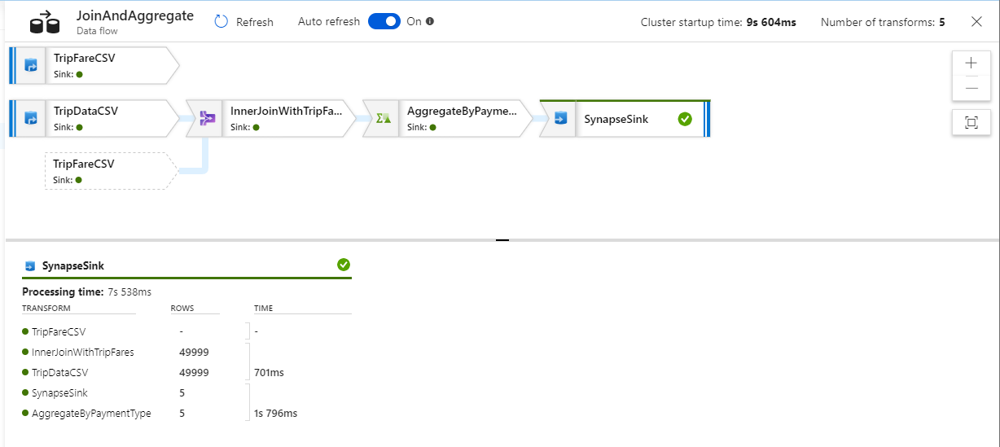
1. You can click a transformation to get additional details on its execution such as partitioning information and new/updated/dropped columns.

    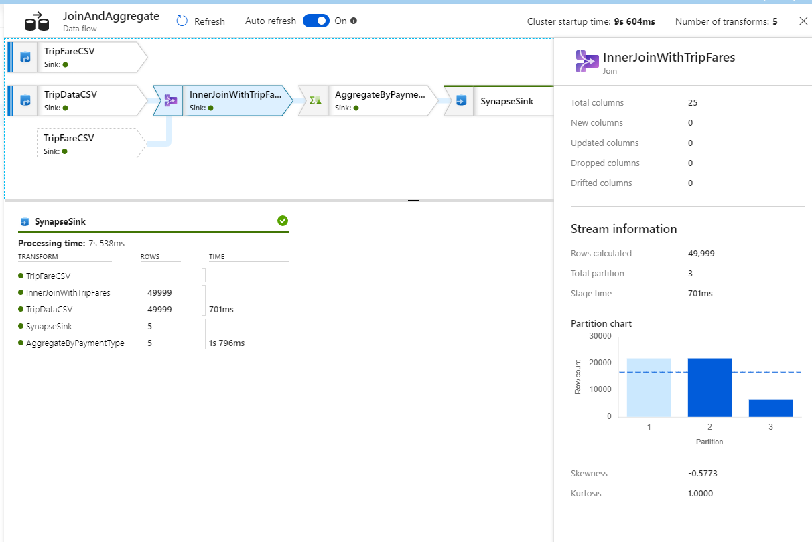

### Publish your changes to the data factory service and run a trigger run

1. Now that you verified your pipeline run works end-to-end in a debug/sandbox environment, you are ready to publish it against the data factory service. Click **Publish all** to publish your changes. ADF will first run a validation check to make sure all of your resources meet our service requirements. If you receive a failure, a side panel will appear detailing the error.

1. Once you have successfully published your pipeline, you can trigger a pipeline run against the data factory service by clicking **Add trigger**. 

1. When the trigger menu appears, select **Trigger now**. This will kick off a manual one-time pipeline run. This menu is also where you set up recurring schedule and event-based triggers operationalize your pipeline.

1. You can monitor a trigger run by selecting the monitoring icon in left side-bar. By default, Azure Data Factory keeps pipeline run information for 45 days. To persist these metrics for longer, configure your data factory with Azure Monitor.

1. Click on the name of the pipeline you triggered to open up more details on the activity information. Here, you can see details of the pipeline run as you did with the debug run. 
    
    *Note: Triggered data flows spin up a just-in-time Spark cluster which is terminated once the job is concluded. As a result, each data flow activity run will endure 5-7 minutes of cluster start-up time.*

You have now completed the data factory portion of this lab. You successfully ran a pipeline that ingested data from Azure SQL Database to Azure Data Lake Storage using the copy activity and then aggregated that data into an Azure Synapse Analytics. You can verify the data was successfully written by looking at the SQL Server itself.

Congratulations, you have reached the end of the lab!